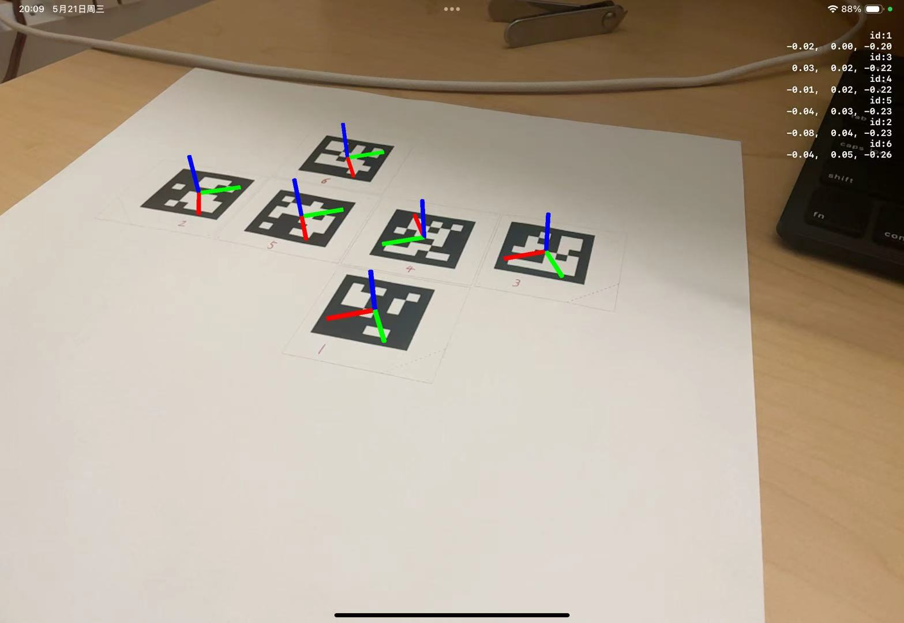

# iOS AR project template #

待办：原来这个项目是针对于用apple pencil书写的，我们要把它先退回到只acquire每个marker的3D pose就行。
原项目参考下面视频
https://www.youtube.com/watch?v=zoM2F_kCsGM

我在develop的过程中有一个stage就是visualize 6个 marker 的 3D pose，如下图所示。以回到渲染这个可视化阶段为目标。
 
